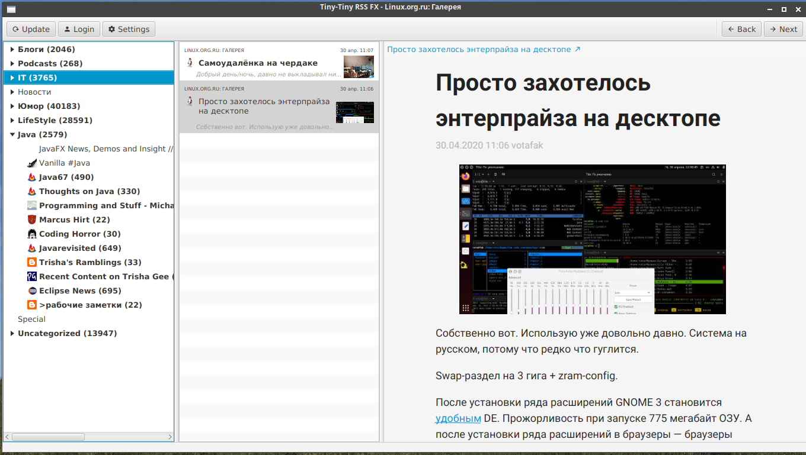
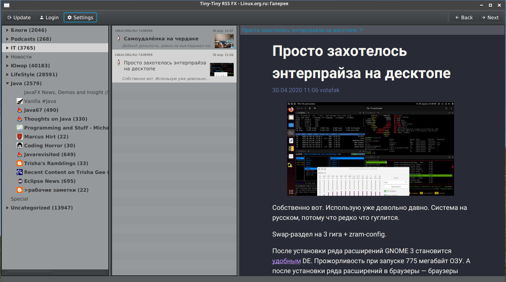
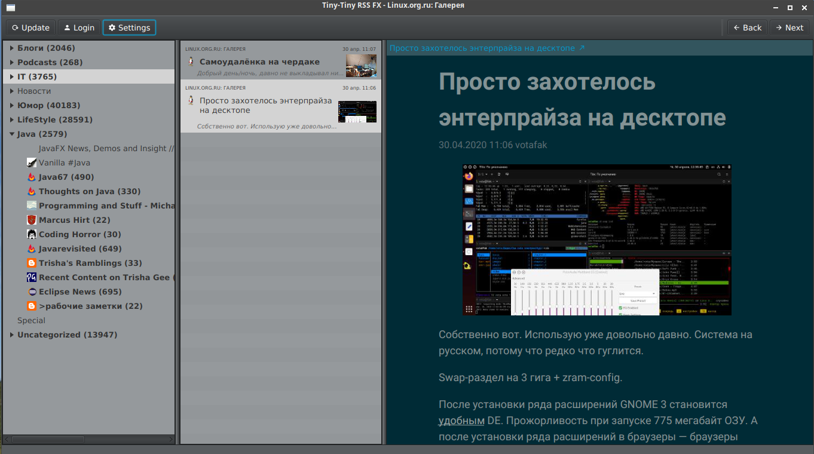

# ttrssfx-client

Десктопный клиент для [Tiny Tiny RSS,](https://tt-rss.org) написанный с использованием JavaFX, а также песочница для экспериментов с JavaFX

## Скриншоты

### Обычный вид

### Dark mode

### Смена цетовой схемы просмотра контента

